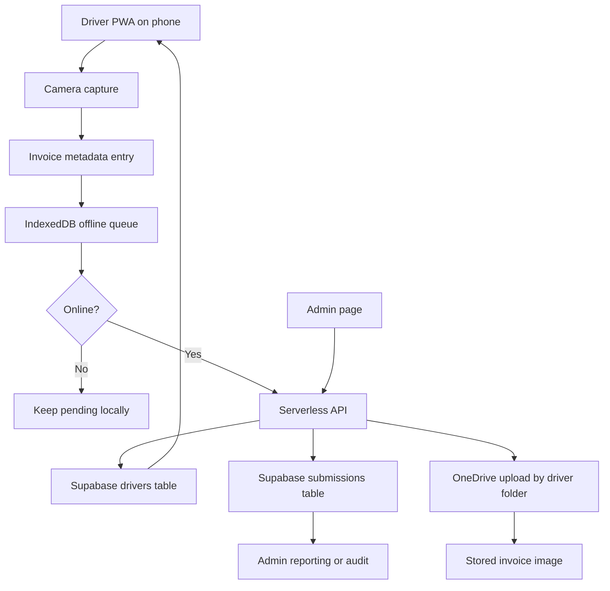

# POD Pulse

A compact installable proof-of-delivery app for delivery drivers.

## What it does
- Lets a driver capture a photo of a signed invoice using the phone camera.
- Applies an invoice-focused capture flow with guide corners, quality warnings, and offline queueing.
- Locks a selected driver to the device on first setup so the driver cannot be switched later from the app.
- Uses payment options: EFT, Cash, S2S.
- Supports admin-only driver updates from a backend API.
- Is designed to evolve from local JSON storage to serverless hosting with Supabase and OneDrive upload.

## Current project structure
- `public/index.html` driver app page
- `public/admin.html` separate admin page for driver management
- `public/css/styles.css` shared UI styles
- `public/js/app.js` driver app logic
- `public/js/admin.js` admin page logic
- `settings/app_settings.json` central UI/theme/config settings
- `data/drivers.json` current local driver list
- `data/submissions.json` current local upload metadata
- `server.js` current local Node server

## Current local run
1. Install Node.js 18+
2. Start the app with `node server.js`
3. Open `http://localhost:3000`
4. Open `http://localhost:3000/admin.html` for driver administration

## Offline-first target architecture
The serverless version should keep capture and queueing offline on the device, while moving sync, storage, and admin updates to hosted services.



## Offline-first design rules
- Camera capture, driver lock, invoice entry, quality checks, and queue storage must work without internet.
- The app should upload only when the device is online.
- The backend should never be required at capture time.
- The admin page can be online-only.
- Each queued submission should have a stable device-generated ID so retries are duplicate-safe.
- IndexedDB should replace localStorage for offline records because image payloads grow too large for localStorage.

## OneDrive folder setup
Use this setup so each driver has a dedicated OneDrive destination folder.

1. In OneDrive, create a root folder named `POD_Uploads`.
2. Create one subfolder per driver, for example:
   - `POD_Uploads/Ava`
   - `POD_Uploads/Jonathan`
   - `POD_Uploads/Maria`
3. In the admin page, set each driver's `folder` value to match the subfolder name exactly.
4. Keep a consistent naming rule:
   - Use plain names with no trailing spaces.
   - Avoid duplicate folder names.
5. Confirm the mapping by checking the driver record in storage:
   - `name` = display name in app
   - `folder` = exact OneDrive subfolder name

### Recommended permissions
- Create a dedicated Microsoft 365 service account for uploads.
- Share `POD_Uploads` with that account as `Can edit`.
- Keep drivers as `Can view` unless they must manage files.

## Recommended serverless stack
Recommended free-friendly stack for this app:
- Frontend hosting: Vercel or Netlify
- API: Vercel Functions or Netlify Functions
- Database: Supabase
- File destination: OneDrive via Microsoft Graph
- Secrets: host environment variables

This is a good fit because:
- the app already talks to HTTP endpoints
- Supabase replaces local JSON files cleanly
- OneDrive can remain the final invoice store
- the phone app can still work offline by queueing locally in IndexedDB

## Exact Supabase schema
Use these SQL statements in the Supabase SQL editor.

```sql
create extension if not exists pgcrypto;

create table if not exists drivers (
  id text primary key,
  name text not null,
  folder text not null unique,
  active boolean not null default true,
  created_at timestamptz not null default now(),
  updated_at timestamptz not null default now()
);

create table if not exists device_bindings (
  device_id text primary key,
  driver_id text not null references drivers(id) on delete restrict,
  driver_name text not null,
  bound_at timestamptz not null default now(),
  last_seen_at timestamptz not null default now()
);

create table if not exists submissions (
  id text primary key,
  device_id text not null,
  driver_id text not null references drivers(id) on delete restrict,
  driver_name text not null,
  folder text not null,
  invoice_number text not null,
  payment_method text not null check (payment_method in ('EFT', 'Cash', 'S2S')),
  filename text not null,
  captured_at timestamptz not null,
  uploaded_at timestamptz,
  sync_status text not null check (sync_status in ('pending', 'uploaded', 'failed')),
  quality_warnings jsonb not null default '[]'::jsonb,
  image_url text,
  onedrive_item_id text,
  created_at timestamptz not null default now(),
  updated_at timestamptz not null default now()
);

create index if not exists idx_drivers_active on drivers(active);
create index if not exists idx_submissions_driver_id on submissions(driver_id);
create index if not exists idx_submissions_sync_status on submissions(sync_status);
create index if not exists idx_submissions_captured_at on submissions(captured_at desc);

create or replace function set_updated_at()
returns trigger
language plpgsql
as $$
begin
  new.updated_at = now();
  return new;
end;
$$;

create trigger trg_drivers_updated_at
before update on drivers
for each row
execute function set_updated_at();

create trigger trg_submissions_updated_at
before update on submissions
for each row
execute function set_updated_at();
```

### Table purpose
- `drivers`: source of truth for active drivers and OneDrive folder names
- `device_bindings`: optional server-side record of which device is tied to which driver
- `submissions`: metadata for each proof-of-delivery image after sync

### Important storage note
Do not store the invoice image blob in Supabase Postgres long-term.
Preferred flow:
1. app queues image locally in IndexedDB
2. API receives submission when online
3. API uploads image to OneDrive
4. API writes metadata plus `image_url` and `onedrive_item_id` to `submissions`

## API shape for serverless migration
Suggested API endpoints:
- `GET /api/drivers` returns active driver list
- `POST /api/admin/drivers` upserts drivers, admin-only
- `POST /api/bind-device` stores device-driver binding, optional but useful
- `POST /api/upload` uploads one queued submission to OneDrive and writes metadata to Supabase
- `GET /api/submissions/:id` optional lookup for admin/audit use

## Step-by-step migration plan
The safest path is to change storage in layers rather than rewriting everything at once.

### Phase 1: replace localStorage with IndexedDB
1. Create a small browser storage module for queued submissions.
2. Move pending items from `localStorage` to IndexedDB.
3. Keep the same queue item shape:
   - `id`
   - `deviceId`
   - `driverId`
   - `driverName`
   - `folder`
   - `invoiceNumber`
   - `paymentMethod`
   - `timestamp`
   - `imageData`
   - `qualityWarnings`
   - `syncStatus`
4. Add migration logic:
   - read old `pod-queue` localStorage value once
   - write those items into IndexedDB
   - remove old localStorage queue only after successful import
5. Keep health metrics local for now.

### Phase 2: split frontend and backend
1. Keep `public/` and `settings/` as static frontend assets.
2. Replace `server.js` with serverless function files.
3. Keep frontend API calls on the same logical routes so UI changes stay small.

### Phase 3: move drivers from JSON to Supabase
1. Create the `drivers` table.
2. Seed it with current values from `data/drivers.json`.
3. Update `GET /api/drivers` to read only `active = true` rows.
4. Update admin save to upsert drivers into Supabase.
5. Stop reading `data/drivers.json` in production.

### Phase 4: move submissions metadata to Supabase
1. Create the `submissions` table.
2. Update `POST /api/upload` to:
   - accept queued record
   - upload image to OneDrive
   - store metadata row in Supabase
3. Return success with `onedrive_item_id` and `image_url`.
4. Mark local queue item as uploaded only after successful API response.

### Phase 5: add duplicate-safe sync
1. Generate a stable submission ID on the device before queue save.
2. Use that same ID for every retry.
3. In the API, upsert by submission ID rather than blindly insert.
4. If OneDrive already contains the file or Supabase already has the row, return success instead of duplicating.

### Phase 6: harden production behavior
1. Add admin authentication stronger than only an API key if needed.
2. Add rate limiting on admin and upload endpoints.
3. Add logging for failed uploads.
4. Add retry and dead-letter tracking for submissions that repeatedly fail.

## Frontend changes required
Driver app changes:
- replace queue persistence from localStorage to IndexedDB
- add `deviceId` generation and persistence
- track per-item sync status: `pending`, `uploading`, `uploaded`, `failed`
- keep upload health panel based on IndexedDB queue state

Admin app changes:
- keep current UX shape
- change data source from local JSON-backed API to Supabase-backed API
- optional later improvement: require sign-in before page load

## Detailed deployment steps
This section assumes Vercel + Supabase + OneDrive.

### 1. Create Supabase project
1. Go to Supabase and create a new project.
2. Open the SQL editor.
3. Run the schema SQL from the section above.
4. Insert starter drivers manually or with SQL such as:

```sql
insert into drivers (id, name, folder)
values
  ('driver-001', 'Ava', 'Ava'),
  ('driver-002', 'Jonathan', 'Jonathan')
on conflict (id) do update
set name = excluded.name,
    folder = excluded.folder,
    active = true;
```

### 2. Create Microsoft Graph app for OneDrive upload
1. Go to Azure Portal.
2. Create an app registration.
3. Record:
   - tenant ID
   - client ID
   - client secret
4. Grant Microsoft Graph permissions required for OneDrive file upload.
5. Use the service account that has edit access to `POD_Uploads`.

### 3. Prepare the codebase for serverless
1. Move API logic out of `server.js` into serverless functions.
2. Keep static frontend files under `public/`.
3. Keep `settings/app_settings.json` as a static asset.
4. Add environment-based configuration for:
   - Supabase URL
   - Supabase service role key
   - admin key
   - Microsoft Graph credentials

### 4. Deploy on Vercel
1. Push repo to GitHub.
2. Create a new Vercel project from the repo.
3. Configure environment variables in Vercel:
   - `ADMIN_KEY`
   - `SUPABASE_URL`
   - `SUPABASE_SERVICE_ROLE_KEY`
   - `MS_TENANT_ID`
   - `MS_CLIENT_ID`
   - `MS_CLIENT_SECRET`
   - `ONEDRIVE_ROOT_FOLDER=POD_Uploads`
4. Set build/output according to your serverless layout.
5. Deploy.

### 5. Verify production routes
After deploy, verify:
1. `/index.html` loads
2. `/admin.html` loads
3. `/settings/app_settings.json` loads
4. `/api/drivers` returns driver JSON
5. admin save works with correct admin key
6. upload endpoint creates file in correct OneDrive folder

## Detailed testing steps
Test both offline behavior and online sync behavior.

### A. Local functional test
1. Start the app locally.
2. Bind device to a driver.
3. Capture an invoice.
4. Enter a valid invoice like `INV-1042`.
5. Save to queue.
6. Confirm pending count increases.

### B. Offline test
1. Open the app on a phone or browser.
2. Install it as a PWA if possible.
3. Turn off Wi-Fi and mobile data.
4. Capture another invoice.
5. Save it.
6. Confirm:
   - capture still works
   - queue still stores the item
   - status shows pending/offline
   - driver binding remains locked on device

### C. Reconnect and sync test
1. Re-enable internet.
2. Wait for auto-sync or tap sync.
3. Confirm:
   - pending count drops
   - last sync time updates
   - failed count stays zero when successful
   - OneDrive file appears in `POD_Uploads/<driver-folder>/`
   - Supabase `submissions` row is created

### D. Admin test
1. Open `/admin.html`.
2. Enter admin key.
3. Add a driver and folder.
4. Save.
5. Confirm new driver appears in driver list API.
6. Confirm new device can bind to that driver.

### E. Retry and duplicate test
1. Queue one submission.
2. Interrupt network during sync.
3. Retry sync.
4. Confirm only one final submission row exists in Supabase.
5. Confirm OneDrive contains one final file, not duplicates.

### F. Quality and validation test
1. Try an invalid invoice number such as `123`.
2. Confirm save is blocked.
3. Capture a dark or blurry image.
4. Confirm warning is shown before or during save.

## UI settings
Edit `settings/app_settings.json` to change:
- titles and labels
- button text
- payment options
- validation thresholds
- theme presets and active theme
- admin page labels

## Production checklist
- Replace local queue storage with IndexedDB.
- Replace `data/*.json` with Supabase.
- Upload invoice images to OneDrive, not Postgres.
- Add HTTPS-only deployment.
- Add rate limiting for admin and upload endpoints.
- Add stronger admin authentication if required.
- Add duplicate-safe submission IDs and upsert logic.
- Add monitoring for upload failures.
